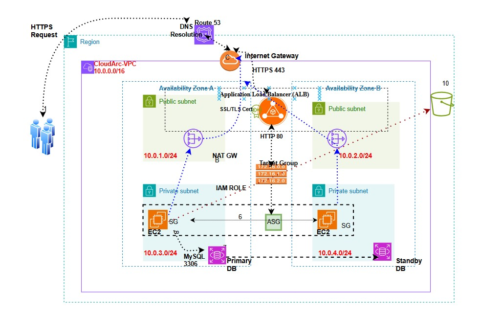

# My AWS Practicals – End-to-End AWS 3-Tier Architecture Project

Designed and deployed a secure, scalable, and highly available AWS environment using core AWS services and best practices.

## Architecture Diagram

## AWS Services Used

- Amazon VPC
- Public and Private Subnets
- Internet Gateway
- NAT Gateway
- EC2 Instances
- Application Load Balancer (ALB)
- Auto Scaling Group (ASG)
- Amazon RDS MySQL
- Amazon S3
- IAM Roles and Policies
- Amazon Route 53
- AWS Certificate Manager (ACM)

## Key Features

- Multi-AZ high availability
- Private backend infrastructure
- Secure IAM role-based access
- Custom domain integration
- SSL/TLS encryption with HTTPS
- HTTP to HTTPS redirection

## Validation Performed

- Verified ALB health checks
- Tested EC2 to RDS connectivity
- Tested EC2 to S3 uploads
- Validated Route 53 DNS resolution
- Confirmed ACM certificate issuance

## Live Demo

🔗 https://myawspractical.com
